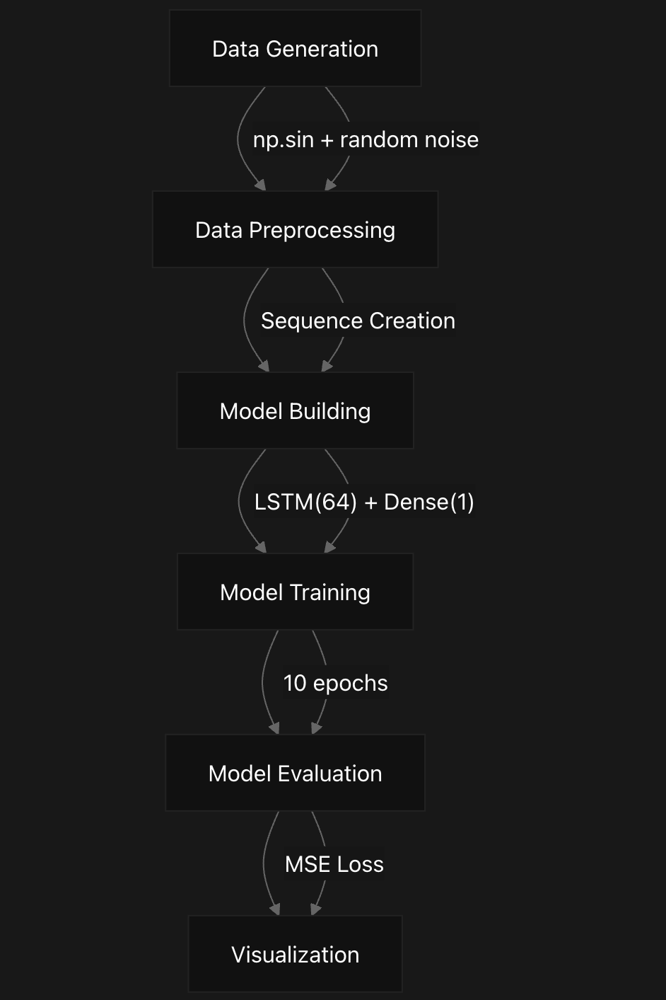
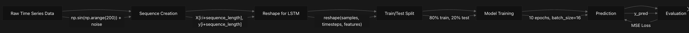
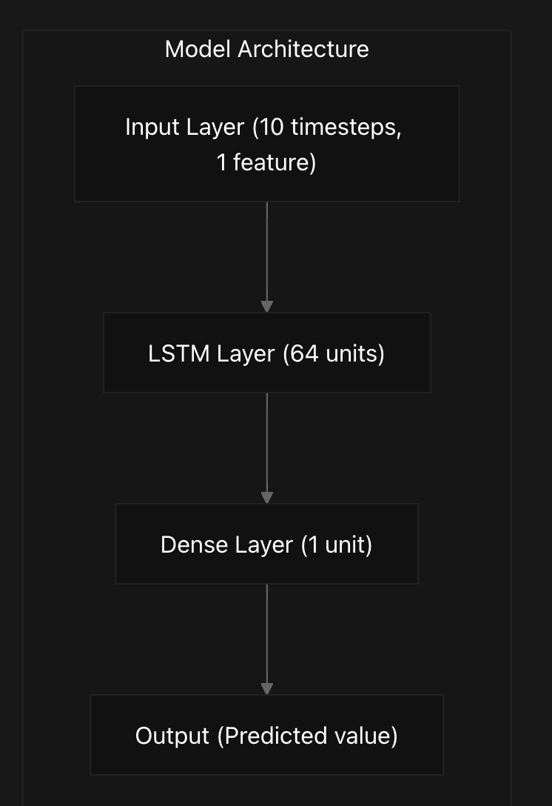
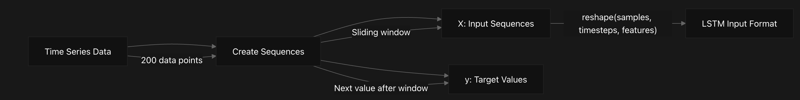
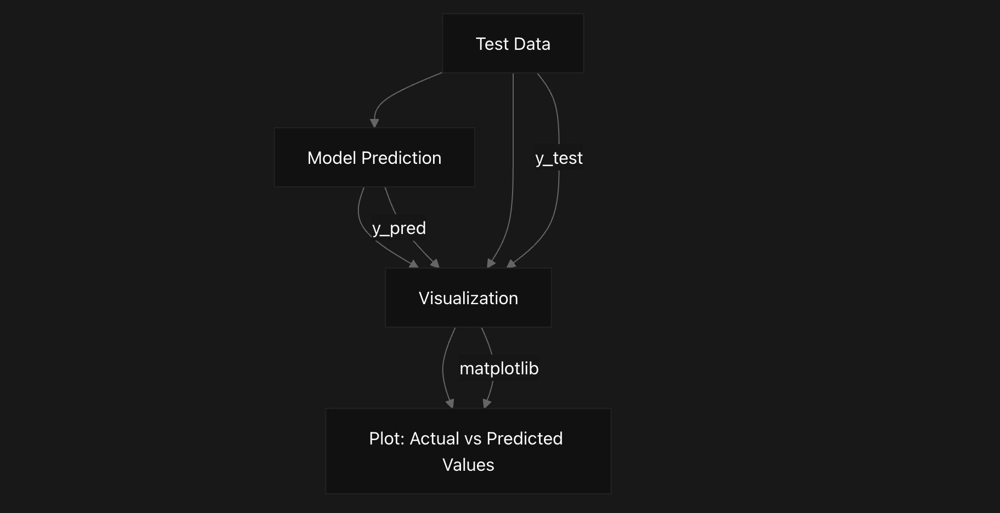
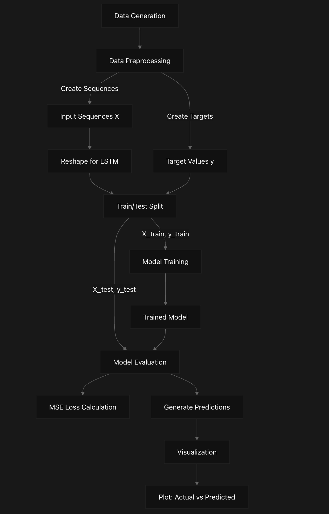
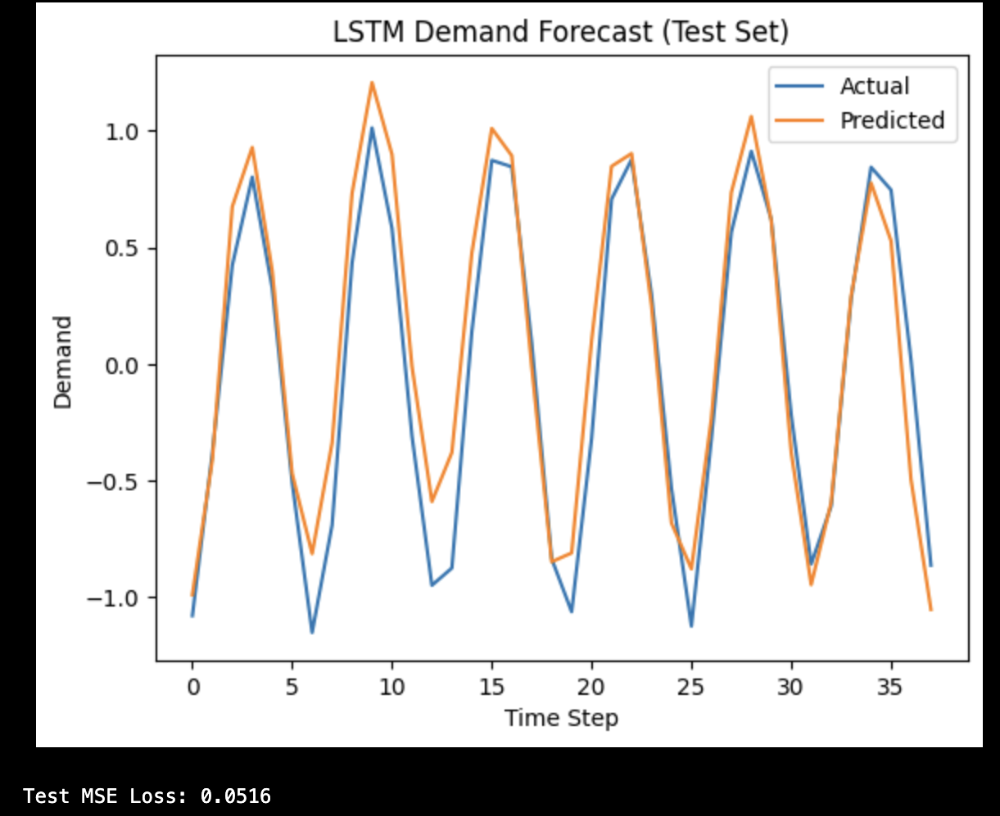

# RNN-Sim Overview
This document provides an overview of the RNN-Sim repository, a time series demand forecasting system implemented using Long Short-Term Memory (LSTM) neural networks. The system demonstrates how to build, train, and evaluate an LSTM model to predict future values in time series data.

## Purpose and Scope
RNN-Sim is designed to:

- Generate synthetic time series data representing product demand
- Process this data into sequences suitable for LSTM input
- Build and train an LSTM neural network model
- Evaluate the model's predictive performance
- Visualize the results comparing actual vs. predicted values
This implementation serves as a foundational example of how recurrent neural networks can be applied to time series forecasting problems.

## System Architecture
The following diagram illustrates the high-level architecture of the RNN-Sim system:


## Data Processing Pipeline
The system follows a sequential data processing workflow that transforms raw time series data into predictions:


## LSTM Model Architecture
The neural network architecture consists of an LSTM layer followed by a Dense output layer:


## Implementation Details
###Data Generation
The system generates synthetic time series data using a sine wave with added random noise:
```
data = np.sin(np.arange(200)) + np.random.randn(200)*0.1
```
This simulates realistic time series data with a clear pattern and some variability.

The generated data is then processed into sequences of length 10, where each sequence (X) is used to predict the next value (y) in the time series:


## Model Training and Evaluation
The model is trained using the Adam optimizer with Mean Squared Error (MSE) as the loss function:
```
model.compile(optimizer='adam', loss='mse')
history = model.fit(X_train, y_train, epochs=10, batch_size=16, validation_split=0.1, verbose=0)
```
The training process involves:
- 10 epochs
- Batch size of 16
- 10% of training data used for validation
After training, the model is evaluated on the test set to measure its prediction accuracy:
```
loss = model.evaluate(X_test, y_test, verbose=0)
y_pred = model.predict(X_test)
```
## Visualization
The system visualizes the model's performance by plotting actual vs. predicted values:


Technical Implementation
The entire system is implemented in a single Jupyter notebook using TensorFlow/Keras for the neural network implementation:

Component	Implementation	Description
Data Generation	NumPy	Creates synthetic time series data using sine wave with noise
Data Preprocessing	NumPy	Transforms data into sequences for LSTM input
Model	TensorFlow/Keras	LSTM(64) followed by Dense(1) layer
Training	TensorFlow/Keras	Adam optimizer, MSE loss, 10 epochs
Evaluation	TensorFlow/Keras	MSE on test set
Visualization	Matplotlib	Line plot of actual vs. predicted values

## System Workflow
The complete workflow of the RNN-Sim system is as follows:

This workflow represents the end-to-end process of the time series forecasting system, from data generation to final evaluation and visualization.

# Summary
RNN-Sim demonstrates a complete implementation of time series forecasting using LSTM neural networks. The system follows a straightforward workflow of data generation, preprocessing, model building, training, evaluation, and visualization. The simplicity of the implementation makes it a good starting point for understanding how recurrent neural networks can be applied to time series prediction problems.

## Code Notebook:
**Copy and Run This Code**

```
    import numpy as np
    import tensorflow as tf
    from tensorflow.keras.models import Sequential
    from tensorflow.keras.layers import LSTM, Dense
    import matplotlib.pyplot as plt
    
    #1. DATA GENERATION
    data = np.sin(np.arange(200)) + np.random.randn(200)*0.1  # Synthetic timeseries
    sequence_length = 10
    
    X, y = [], []
    for i in range(len(data) - sequence_length):
        X.append(data[i:i+sequence_length])
        y.append(data[i+sequence_length])
    X, y = np.array(X), np.array(y)
    
    X = np.reshape(X, (X.shape[0], X.shape[1], 1))  # LSTM expects [samples, timesteps, features]
    
    # Train/Test split
    split_idx = int(0.8 * len(X))
    X_train, X_test = X[:split_idx], X[split_idx:]
    y_train, y_test = y[:split_idx], y[split_idx:]
    
    #2. MODEL BUILD
    model = Sequential([
        LSTM(64, input_shape=(sequence_length, 1)),
        Dense(1)
    ])
    model.compile(optimizer='adam', loss='mse')
    
    #3. TRAINING
    history = model.fit(X_train, y_train, epochs=10, batch_size=16, validation_split=0.1, verbose=0)
    
    #4. EVALUATION
    loss = model.evaluate(X_test, y_test, verbose=0)
    y_pred = model.predict(X_test)
    
    #5. VISUALIZATION: Actual vs. Predicted Demand
    plt.figure()
    plt.plot(y_test, label='Actual')
    plt.plot(y_pred.flatten(), label='Predicted')
    plt.title("LSTM Demand Forecast (Test Set)")
    plt.xlabel("Time Step")
    plt.ylabel("Demand")
    plt.legend()
    plt.show()
    
    print(f"Test MSE Loss: {loss:.4f}")
 ```   

